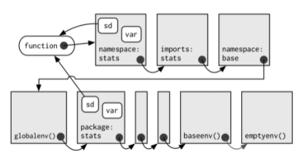
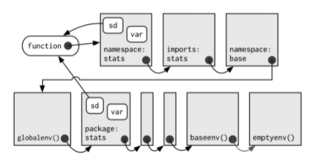

## R environments

### Environment basics

```{r}
library(pryr)    # understand language at deeper level

e <- new.env()
parent.env(e)

e$a <- 5
e$b <- e$a

e$b
e$a <- 7

e$b

ls(globalenv())    # interactive ws; parent of globalenv is last env attached (library or require)
ls(e)
ls(baseenv())      # where base functions live
ls(emptyenv())     # ultimate ancestor
ls(environment())  # current env

search()
ls(as.environment("package:stats"))

attach(e)    # attaches to search path
a
a <- 8
e$a
a
get("a")
get("a", envir = e)

e$.hidden <- "hello from hidden"
ls(e)
ls(e, all.names = TRUE)
e$.hidden

ls.str(e, all.names = TRUE)
e[[".hidden"]]
# get(".hidden")    # will not find (unless attached again!)

a
rm(a, envir = e)
e$a
a

exists("a")
exists("a", envir = e)    # but is taken from global env
exists("a", envir = e, inherits = FALSE)
where("a")


df <- data.frame(c = "hello", d = "world")
?what
attach(df)    # can be a data.frame, list, env, datafile
c
```

### Function environments

- The enclosing env determines how the function finds values.
- The binding env determines how we find the function.
- Every exported function in a package is bound into the package env but enclosed by the namespace env.

```{r}
# TODO: how to switch working env (aka interactive workspace)?


f <- function(x) x + 1
environment(f)         # enclosing env (env where function was created - can be changed though...)
e$g <- function() y
environment(e$g)       # enclosing is globalenv! BUT binding env is e
e$y <- 8
y <- 7
e$g()
environment(e$g) <- e  # change enclosing env!
e$g()

# REMEMBER: 
# The enclosing env determines how the function finds values.
# The binding env determines how we find the function.
# Every exported function in a package is bound into the package env but
# enclosed by the namespace env.
environment(sd)    # enclosing env
where("sd")        # binding env
ls(as.environment("package:stats"))
```

So basically, the enclosing env is where a function finds its values (also other functions it calls)! Therefore the `NAMESPACE` can be created which simply defines an env which is then set to be the enclosing env of all functions within a package! That ensures, that we don't overwrite the behaviour of a function (f.ex. `stats::sd` calling `stats::var`): "Every exported function in a package is bound into the package environment, but enclosed by the namespace environment."

{width=50%}

{width=50%}

```{r}
e$f <- function() {
  parent.frame()    # returns env where function was called! (unfortunate naming convention)
}

e$f()
```

Looking up variables in the calling environment rather than in the enclosing environment is called **dynamic scoping**. However, R's regular scoping rules only use the enclosing environment for value lookup!

### Binding names to values

```{r}
"%<d-%"    # delayed binding: evaluates expression when needed
x %<a-% runif(1)    # active bindings: not bound to a constant object
x
x
```

### Enironments as data structures

Useful in their own rights since environments use **reference semantics**, i.e. when you modify an environment, it does not make a copy. You can use environments to track (package) states, pass values between functions... In the latter case, set `parent = emptyenv()` such that you don't accidentaly inherit unwanted values!

- Avoiding copies of large data
- Managing state within a package
- Efficiently looking up values from names (hashmap)
